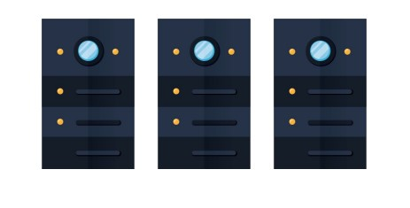
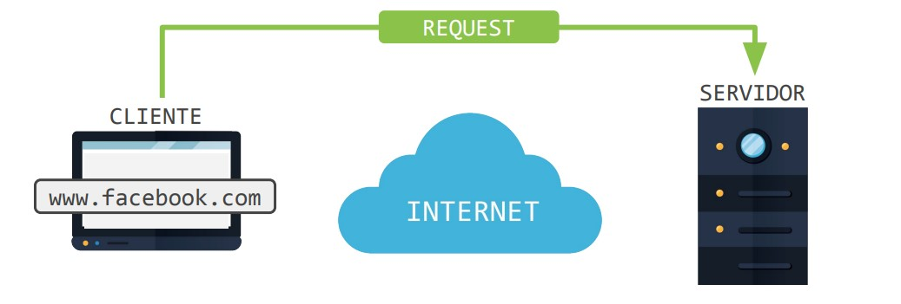
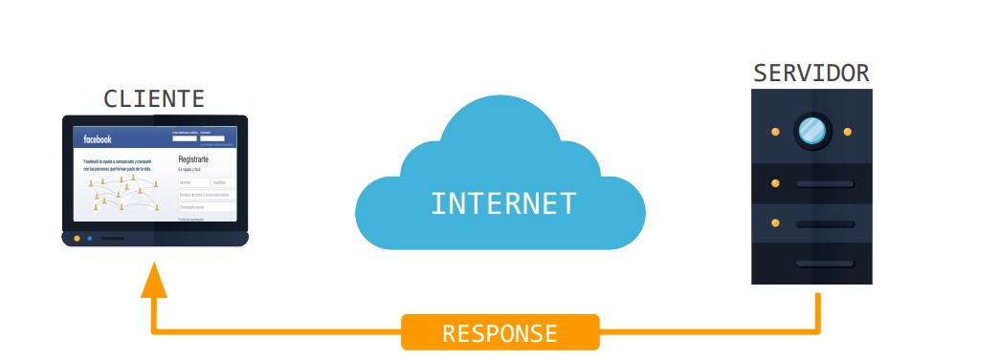
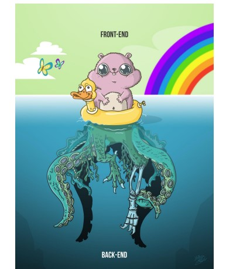
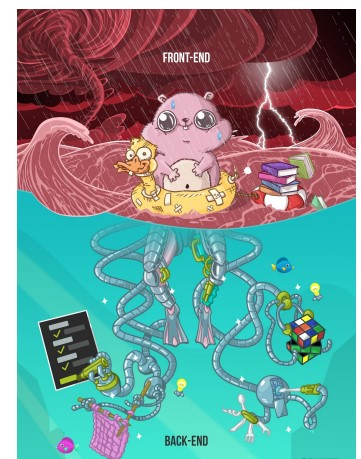

# Lección 1: ARQUITECTURA CLIENTE SERVIDOR

* ARQUITECTURA CLIENTE SERVIDOR
* A QUÉ LLAMAMOS CLIENTE
* A QUÉ LLAMAMOS SERVIDOR
* FLUJO CLIENTE SERVIDOR
* FRONT-END
* BACK-END

## ARQUITECTURA CLIENTE SERVIDOR

Dentro del contexto de desarrollo web, esta arquitectura hace referencia a un modelo de comunicación que vincula a varios dispositivos con un servidor a través de internet.

## A QUÉ LLAMAMOS CLIENTE

Son los dispositivos que hacen peticiones de servicios o recursos a un servidor.
Pueden ser: una computadora, un teléfono celular, una tablet, una consola de video juegos o cualquier implemento que tenga la capacidad de conectarse a una red.
Dentro de Internet, el cliente suele acceder a estos servicios y recursos a través de un navegador web

## A QUÉ LLAMAMOS SERVIDOR

Es el equipo que brinda los servicios y recursos a los que acceden los clientes.
Es importante tener en cuenta que la misma computadora puede ser el cliente y el servidor al mismo tiempo.
De hecho es lo más normal en el entorno de desarrollo de un sitio o aplicación web.

## FLUJO CLIENTE SERVIDOR

## REQUEST / SOLICITUD
Es la solicitud que hacemos a través del navegador (el cliente) a un
servidor, en este ejemplo, la página de Facebook que está almacenada
en sus servidores.

## RESPONSE/ RESPUESTA

El servidor recibe nuestra solicitud, la procesa, y envía como resultado
una respuesta al cliente (navegador), en este ejemplo devolverá la
página principal del sitio.

¿Por qué es importante conocer este flujo Request-Response?
Porque dentro del mundo del desarrollo web, la mayoría de las aplicaciones tienen dos claros frentes: el frontend y el backend.

## FRONT-END

Es todo lo que pasa del lado del cliente (en el navegador).
Aquí se incluyen todos los elementos gráficos que conforman la interfaz del sitio.
Los lenguajes que se manejan son HTML, para la estructura, CSS, para los estilos visuales y
Javascript, para la interacción dentro del sitio.

## BACK-END

Es todo lo que pasa del lado del servidor.
Aquí se incluye todo el funcionamiento interno y lógica del sitio. Es lo que permite que se carguen todas las peticiones solicitadas por el cliente.
Algunos de los lenguajes que se manejan son MySQL, para base de datos, PHP, para sitios webs dinámicos, entre otros.

