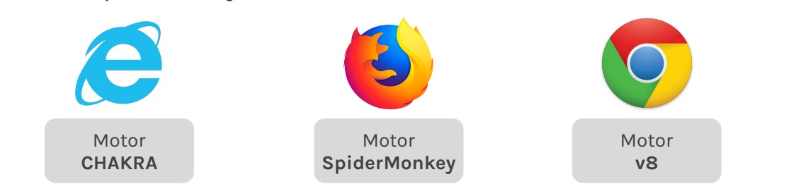
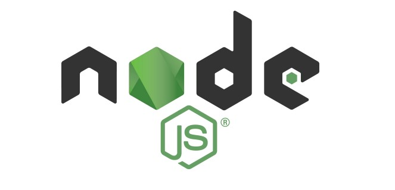

# Lección 2: INTRODUCCIÓN A NODE JS

* INTRODUCCIÓN A NODE JS
* ARQUITECTURA NODE JS
* PROBANDO NODE JS

## INTRODUCCIÓN A NODE JS

Es un entorno de ejecución que nos permite ejecutar Javascript por fuera de un navegador.

## ARQUITECTURA NODE JS

Todos los navegadores presentan un motor de Javascript para leer y renderizar código JS. Esto hace que el lenguaje dependa sí o sí de un navegador para poder ejecutarse.

Los navegadores entre sí utilizan distintos motores, y es por esta variedad que a veces un mismo código JS puede comportarse de manera diferente dependiendo del navegador en el que se esté ejecutando.

Node JS está construído bajo el motor v8 de Google Chrome. Esto lo convierte en un entorno de ejecución para Javascript y logra que el lenguaje deje de depender del navegador para poder ejecutarse.
De esta forma, podemos programar tanto el Front-end como el Back-end en un mismo lenguaje: Javascript.

## INSTALANDO NODE JS (En Nuestro caso ya lo tenemos)

Lo primero que hay que hacer es descargar Node.js desde su página oficial: nodejs.org/es
Conjuntamente con Node.js se va a instalar el gestor de paquetes NPM, que veremos a fondo más adelante.
Para verificar que se instaló correctamente, abrir una terminal y ejecutar el comando ó .
node -v node --version

Tener en cuenta que al instalar Node no estamos instalando un software si no un entorno de ejecución.

## PROBANDO NODE JS

Para testear NodeJS, crear una carpeta llamada Node. 
Abrir el editor de texto Visual Studio Code. Ir a Archivo/Abrir carpeta y seleccionar la carpeta que creamos recién. 

Crear un archivo llamado prueba.js y escribir el siguiente script: 
console.log('Probando Node!');

Abrir una terminal. Para eso, ir a Terminal/Nueva terminal, o ejecutar el atajo ctrl + shift + ñ. En la terminal escribir el siguiente comando:
node prueba.js

Si todo anduvo bien, veremos en la terminal el mensaje: Probando Node!.

