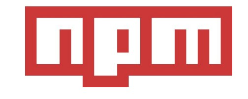
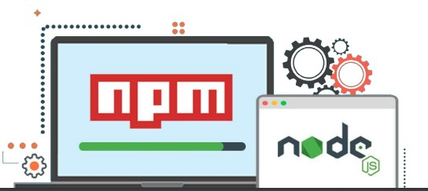

# Lección 2: NODE PACKAGE MANAGER NPM

* NODE PACKAGE MANAGER NPM
* INTRODUCCIÓN A NPM
* QUÉ SON LAS LIBRERÍAS
* package.json
* INSTALANDO LIBRERÍAS

## NODE PACKAGE MANAGER NPM

NPM es el gestor de paquetes de Node y nos permite descargar e instalar librerías para incorporar a nuestro proyecto.

## INTRODUCCIÓN A NPM

Cuando instalamos Node en nuestras computadoras, se instalan múltiples librerías para poder usar globalmente, y, conjuntamente, se instala NPM, el gestor de paquetes de Node.

A través de él vamos a poder instalar las librerías que consideremos necesarias para el desarrollo de nuestra aplicación. Podemos instalarlas localmente, disponibles para usar en un proyecto en específico, ó globalmente, disponibles para usar cada vez que queramos.



## QUÉ SON LAS LIBRERÍAS

Son bloques de código que nos permiten abordar soluciones específicas dentro de la aplicación que estemos desarrollando.
En un entorno de desarrollo web, hay situaciones que se repiten una y otra vez. Las librerías llegan para facilitar esas problemáticas que sabemos que nos vamos a cruzar mientras desarrollamos nuestra aplicación. Manejar la subida de archivos, validar un formulario, o restringir el acceso a un usuario que no está registrado son algunas de ellas.



## USANDO NPM

Cuando se instala Node, se genera un comando para usar en la terminal.

Lo primero que hay que hacer para usar npm es inicializar nuestro proyecto Node usando el comando npm init . Este comando creará un archivo package.json, dentro del cual se se irán guardando todas las configuraciones del proyecto. Por el momento, la característica que más nos interesa de este archivo es la propiedad "main" . La misma hace referencia al entry point, es decir, el punto de entrada a nuestra aplicación, en donde pondremos el nombre de nuestro archivo principal, que, por convención solemos llamar app.js .

## package.json

```javascript
{
 "name": "app",
 "version": "1.0.0",
 "description": "",
 "main": "app.js",// Dirección al Entry Point (punto de
//entrada)
 "scripts": {
 "test": "echo \"Error: no test specified\" && exit 1"
 },
 "author": "",
 "license": "ISC"
}

```

## INSTALANDO LIBRERÍAS

Para instalar una librería usamos el siguiente comando:
 npm install PACKAGE --save en donde reemplazaremos la
palabra PACKAGE  por el nombre de la librería que queramos
instalar.
El comando --save guarda dentro del package.json, en la
propiedad "dependencies" , una referencia a la librería que
estamos instalando.

```javascript
 "main": "app.js",
 "scripts": {
 "test": "echo \"Error: no test specified\" && exit 1"
 },
 "author": "",
 "license": "ISC",
"dependencies": {  // Referencia a la/las librerías que
// instalemos en nuestro proyecto.
 "moment": "^2.24.0"
 }
}
```
Dentro de la carpeta Node
Modules se irán creando las carpetas de las librerías que instalemos.
Cada una contendrá los archivos necesarios para poder trabajar con esa librería dentro del proyecto.


