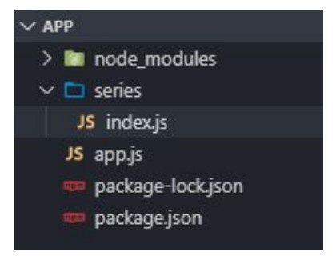

# Lección 4: NODE MODULES

* NODE MODULES
* QUÉ ES UN MÓDULO
* CÓMO REQUERIR UN MÓDULO
* MÓDULO DE TERCEROS
* MÓDULO CREADO

## NODE MODULES

Son estructuras de código que, en conjunto, conforman la totalidad de nuestra aplicación y configuran su usabilidad.

## QUÉ ES UN MÓDULO

Un módulo es un bloque de código reusable, una unidad funcional, cuya existencia o no, no altera el comportamiento de otros bloques de código.
A partir de eso, Node propone atomizar nuestro código, es decir, fragmentarlo en pequeños módulos, en donde cada uno tendrá una funcionalidad específica para alcanzar un objetivo definido

Existen tres tipos de módulos:

Los módulos nativos, aquellos
que ya vienen instalados.

Los módulos de terceros,
aquellos que podemos instalar
usando NPM.

Los módulos creados, aquellos
que definimos nosotros.

## CÓMO REQUERIR UN MÓDULO

Para requerir un módulo, sin importar de qué tipo sea, hace falta situarse dentro del archivo en el que queremos incorporarlo y hacer uso de la función nativa de node . La misma recibe como parámetro un string, que será el nombre del módulo.
Esta función devuelve un objeto literal, por lo tanto es importante guardar la ejecución en una variable, para poder acceder, a través del dot notation, a todas las propiedades y funcionalidades del módulo.

```javascript
let modulo = require('nombreModulo');
modulo.propiedad;
modulo.funcionalidad() 
```

Por convención, el nombre de la
variable que almacene el módulo
que estamos requiriendo, suele
recibir el mismo nombre del
módulo, o una abreviatura

Para requerir un módulo nativo usamos la función y le pasamos como argumento el nombre del módulo que queremos requerir.
En este link (https://nodejs.org/api/) vas a encontrar los módulos que vienen incluidos cuando instalamos Node, listados en orden alfabético a la izquierda.

```javascript
const fs = require('fs');
```

## MÓDULO DE TERCEROS

Para requerir un módulo de terceros, primero hay que instalarlo usando el comando .
Una vez instalado, usamos la función y le pasamos como argumento el nombre del módulo que instalamos.

npm install moment --save

```javascript
const moment = require('moment');
```

## MÓDULO CREADO

Para requerir un módulo creado por nosotros, primero hay que crear un archivo con extensión .js y dentro del mismo escribir el script que necesitemos.
Una vez definido nuestro código, tenemos que dejarlo accesible
para poder importarlo dentro de nuestra aplicación. Para eso hay que hacer uso del objeto nativo module y de su propiedad
. . Al mismo le asignaremos el nombre de la variable que contenga la información que queremos exponer.

---------------------------------------------------------------------

Definimos un array de series, en donde en cada posición hay un objeto literal con las propiedades titulo y temporadas, conteniendo la información de cada serie.
```javascript
const series = [
{titulo: 'Mad Men', temporadas: 7},
{titulo: 'Breaking Bad', temporadas: 5},
{titulo: 'Seinfeld', temporadas: 9},
];

module.exports = series;
```
Hacemos uso del objeto module y su propiedad exports, y le asignamos la variable que queremos exportar, en este caso, series. Tener en cuenta que siempre que queramos exportar módulos de un script, tendremos que escribir esta línea al final del mismo.

-----------------------------------------------------------------------

Una vez que exportamos nuestro módulo, vamos al archivo en donde lo queremos importar y usamos la función .
En este caso le pasamos como argumento la ruta hacia el script donde se encuentra el módulo que queremos requerir. Para eso, usamos el . De esta forma le estamos indicando a Node que el camino para llegar a ese módulo empieza desde donde estamos parados (app.js) hasta el nombre del archivo que le pasemos.

Como buena práctica, se suelen almacenar los
módulos que creamos dentro de una carpeta con el
mismo nombre del módulo que estamos por crear.

----------------------------------------------------------------------

Cuando nos referimos a archivos de Javascript no hace falta
escribir la extensión.




```javascript
const series = require('./series/index');
```

Para poder ver todo lo que trae
consigo un módulo, podemos
hacer un console.log() de la
variable en la que lo
almacenamos.


