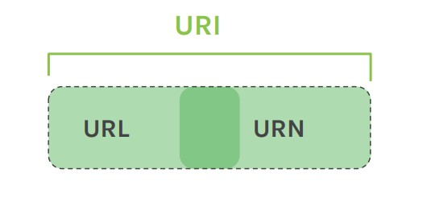
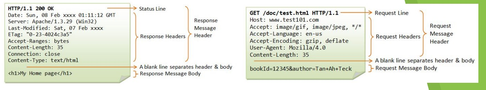

# Lección 5: INTRODUCCIÓN A HTTP

* INTRODUCCIÓN A HTTP
* COMPONENTES DE UNA URI
* CÓMO VIAJA LA INFORMACIÓN
* MÉTODOS DE PETICIÓN:
* GET
* POST
* DELETE
* PUT
* PATCH
* CÓDIGOS DE ESTADO HTTP

## INTRODUCCIÓN A HTTP

HTTP (Hyper Text Transfer Protocol) es el protocolo que gestiona las transacciones web entre clientes y servidores.

## QUÉ ES UNA URI

El protocolo HTTP permite la transferencia de información en la web a través de direcciones web, técnicamente llamadas URI. Una URI (identificador de recursos uniformes) es un bloque de texto que se escribe en la barra de direcciones de un navegador web y está compuesto por dos partes: la URL y la URN.

## COMPONENTES DE UNA URI

URL
Indica dónde se encuentra el recurso que deseamos obtener y
siempre comienza con un protocolo. En este caso HTTP

https://

URN
Es el nombre exacto del recurso uniforme. El nombre del
dominio y, en ocasiones, el nombre del recurso

arbusta.net/

Dentro de esta estructura de comunicación, hablamos de request cada vez que el cliente le solicita un recurso al servidor, y de response cada vez que el servidor le devuelve una respuesta al cliente.

## CÓMO VIAJA LA INFORMACIÓN

Cada vez que usamos este protocolo, se envía a través de él información importante. La información viaja a través de los headers o cabeceras, que son porciones de texto conteniendo esa información requerida por el cliente y por el servidor

## MÉTODOS DE PETICIÓN

El protocolo HTTP define métodos de petición. Cada método representa una acción y, si bien comparten algunas características, implementan funcionalidades diferentes entre sí.

Los métodos más utilizados por este protocolo son:

## GET

Se utiliza para pedirle información al servidor de un recurso específico. Cada vez que escribimos una dirección en el navegador o accedemos a un enlace, estamos utilizando el método GET. En caso de querer enviar información al servidor usando éste método, la misma viajará a través de la URL.

## POST

Se utiliza para enviar datos al servidor. Este método es más seguro que get ya que la información no viaja a través de la URL.

## DELETE

Borra un recurso presente en el servidor. Cuando eliminamos un posteo en facebook, por ejemplo, estamos utilizando este método.

## PUT

Es muy parecido a post. Se usa para reemplazar toda la información actual de un recurso presente en el servidor.

## PATCH

Similar a PUT. Es utilizado para aplicar modificaciones parciales a un recurso en el servidor.

PUT y PATCH suelen ser lo mismo. Elegir entre uno y otro va a depender del contexto y lo que queramos implementar en nuestra aplicación. Al editar un posteo o un perfil estamos usando alguno de estos dos métodos.

## CÓDIGOS DE ESTADO HTTP

Cada vez que el servidor recibe una petición request, el mismo emite un código de estado que indica, de forma abreviada, el estado de la respuesta HTTP. El código tiene tres dígitos. El primero representa uno de los 5 tipos de respuesta posibles:
1 xx Respuestas informativas
2 xx Respuestas exitosas
3 xx Redirecciones
4 xx Errores del cliente
5 xx Errores de servidor

Algunos códigos conocidos:
200 OK
307 Temporary Redirect
403 Forbidden
404 Not Found
500 Internal Server Error

HTTPS es un protocolo mejorado de HTTP. Usando este protocolo, el servidor codifica la sesión con un certificado digital, dándole al usuario ciertas garantías de que la información que envíe desde esa página no será interceptada ni utilizada por terceros 