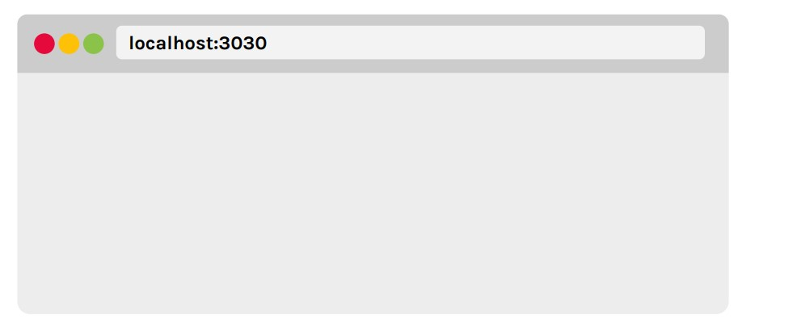
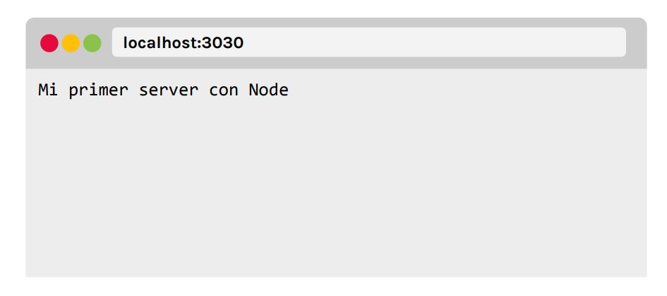

# Lección 6: INTRODUCCIÓN A HTTP

* HTTP EN NODE JS
* CÓMO USAR HTTP
* LEVANTAR EL SERVIDO
* TESTEAR EL SERVIDOR
* DEFINIENDO EL RESPONSE
* TESTEAR EL SERVIDOR


## HTTP EN NODE JS

Usando el módulo nativo HTTP, podemos crear un servidor web dentro de nuestro proyecto

## CÓMO USAR HTTP

Lo primero que tenemos que hacer es requerir el módulo nativo en el entry-point de nuestra aplicación:app.js . 
```javascript
const http = require('http');
```

En la variable http tenemos almacenado un objeto, que presenta todas las propiedades y funcionalidades que necesitamos para crear nuestro servidor. Lo siguiente, es pedirle a ese objeto, el método createServer() , que se encargará de levantar el servidor y manejar las peticiones que le lleguen.

```javascript
http.createServer();
```

Este método recibe como parámetro un callback, que se ejecutará cada vez que se envíe un request al servidor. El callback recibirá dos parámetros: el primero representa los datos que envió el cliente como solicitud (request), el segundo representa la respuesta que le enviará el servidor al cliente (response).

```javascript
http.createServer(function (req, res){
//cuerpo del callback
});
```

Es momento de definir el puerto en el que el servidor escuchará las peticiones. Eso lo haremos a través del método , el cual recibe dos parámetros: el primero, el puerto donde se escuchará la aplicación (puede ser cualquier número de 4 dígitos), y el segundo, el dominio donde queremos que se ejecute el servidor.
```javascript
http.createServer(function (req, res){
//cuerpo del callback
}).listen(3030, 'localhost');
```

## QUÉ ES UN PUERTO

¿Qué pasaría si vamos a un edificio a visitar a alguien, pero no sabemos ni el piso, ni el departamento? En ese caso no sabríamos qué timbre tocar y quedaríamos a la espera sin poder hacer demasiado.
Nosotros necesitamos saber el timbre para poder, efectivamente, visitar a esa persona.
Lo mismo pasa con un servidor. Necesita saber el puerto, que no es más que un número que representa una dirección específica en donde irá a procesar las peticiones del cliente.

Hasta el momento:
Creamos un servidor que corre
en el dominio localhost y escucha
en el puerto 3030

## LEVANTAR EL SERVIDOR

Para levantar el servidor haremos uso de la consola para ejecutar nuestro archivo entry-point.

node app.js

Al ejecutar ese comando, la consola quedará inhabilitada, sin poder escribir ningún comando sobre ella. Esto sucede porque, una vez levantado el servidor, el mismo se queda "escuchando" por los request y response en el puerto definido.
Para cortar el servidor, presionamos para ctrl + c
 windows y linux, cmd + c para mac

 ## TESTEAR EL SERVIDOR

 

 Ya tenemos la estructura necesaria para hacer las peticiones al servidor.
Es momento de definir el response que nos dará el mismo.

## DEFINIENDO EL RESPONSE

Lo primero que hay que hacer es definir las cabeceras.
Para crearlas usaremos el método writeHead() que lo ejecutaremos sobre el parámetro res , que será el response. El método recibe dos parámetros: el primero, un número de 4 dígitos que representará el status de la petición, el segundo, un objeto literal que define el tipo de contenido que se le está enviando al cliente.

```javascript
http.createServer(function (req, res){
res.writeHead(200, {"Content-Type": "text/plain"});
}).listen(3030, 'localhost');
```

## DEFINIENDO EL RESPONSE

Ahora es momento de definir el contenido que le enviaremos al cliente. Para eso usaremos el método end() que recibe como parámetro un string, que representará el cuerpo del contenido que estaremos enviando.
Este método debe ir siempre después de la definición de las cabeceras, y cuando éste termina, cierra el ciclo del response.

```javascript
http.createServer(function (req, res){
res.writeHead(200, {"Content-Type": "text/plain"});
res.end('Mi primer server con Node');
}).listen(3030, 'localhost');

```

## TESTEAR EL SERVIDOR

Al levantar el servidor y hacer el request, veremos en el
navegador el string que definimos como response

 

 ## PROCESO ROUTING

 Por cada url que escribamos en el navegador, estamos haciendo un request diferente, y por lo tanto, esperando una respuesta específica en cada caso. Se define routing al proceso en que definimos esas rutas y sus respuestas.

Dentro de la estructura que definimos para crear el servidor, contamos con el parámetro req que será el request que envíe el cliente. El mismo es un dato de tipo objeto, con propiedades y funcionalidades.
La propiedad url nos permite saber qué url ingresó el cliente al momento de hacer el request.

```javascript
http.createServer(function (req, res){
res.writeHead(200, {"Content-Type": "text/plain"});
if(req.url == '/'){
res.end('Mi primer server con Node');
}
if(req.url == '/saludo'){
res.end('Hola! Estamos en localhost:3030/saludo');
}
}).listen(3030, 'localhost');
```

Definimos una estructura if y
preguntamos si el valor que vino
en la propiedad url del objeto
request es "/", es decir, si el
cliente solicitó la ruta raíz de esta
aplicación: localhost:3030

Si la condición es verdadera,
envío como response el string: Mi
primer server con Node

Defino otra estructura if y
pregunto si la ruta que llegó por
request es "/saludo".

Si la condición es verdadera, envío
como response el string: Hola!
Estamos en localhost:3030/saludo

----------------------------------------------------

La cantidad de rutas que
definamos va a depender
exclusivamente de la aplicación
que estemos desarrollando y de
los reponse que queramos dar.