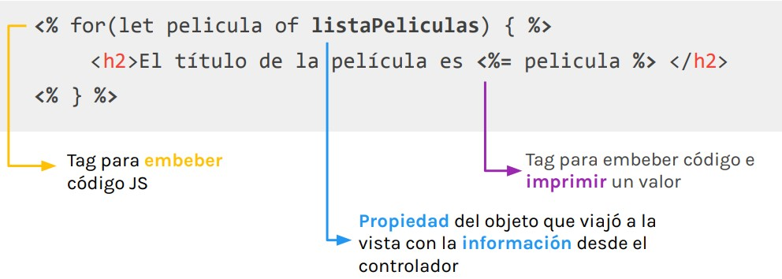

# Lección 10: PARÁMETROS COMPARTIDOS

* PARÁMETROS COMPARTIDOS
* ¿CÓMO MUESTRO UNA VISTA?
* EL OBJETO COMO PARÁMETRO


## PARÁMETROS COMPARTIDOS
La gran ventaja de utilizar un motor de plantillas, es que nos permite compartir información desde los controladores hacia las vistas y disponer de ella como queramos.

## ¿CÓMO MUESTRO UNA VISTA?

Para disponer del código que modularizamos, necesitamos hacer uso de la función include() que nos provee ejs. La misma recibe como parámetro un string que será la ruta hacia el archivo que queremos incluir.

Sobre el objeto response ejecutamos el método  render() , pasándole como argumento el nombre de la vista que queremos renderizar

```javascript
const controller = {
mostrarPeliculas: (req, res) => {
 res.render('peliculas')
}
}
```

## .render()

El método .render() puede recibir un objeto literal como segundo parámetro. Este objeto tendrá almacenada la información que queremos enviar en conjunto con la vista que estemos renderizando.

```javascript
const controller = {
mostrarPeliculas: (req, res) => {
 res.render('peliculas', {} )
}
}
```

## EL OBJETO COMO PARÁMETRO

```javascript
const peliculas = ['Deadpool', 'The Joker', 'Batman'];
const controller = {
mostrarPeliculas: (req, res) => {
 res.render('peliculas', {listaPeliculas: peliculas})
}
}
```

Podemos asignarle la cantidad de propiedades que deseemos a ese objeto.
La vista, por su parte, no recibirá un objeto literal con todas esas propiedad sino que recibirá las propiedades sueltas como variables.

```javascript
const peliculas = ['Deadpool', 'The Joker', 'Batman'];
const controller = {
mostrarPeliculas: (req, res) => {
 res.render('peliculas', {listaPeliculas: peliculas,
extranjeras: true,
genero: 'superhéroes' })
}
}
```

Cada una de esas propiedades será una variable que tendremos disponible en la vista y así disponer de la información que almacena cada una

## MOSTRAR LA INFORMACIÓN

Para mostrar la información en la vista, haremos uso de los tags que nos provee el motor de plantillas ejs y llamaremos a la propiedad que creamos en el objeto para almacenar la información.


