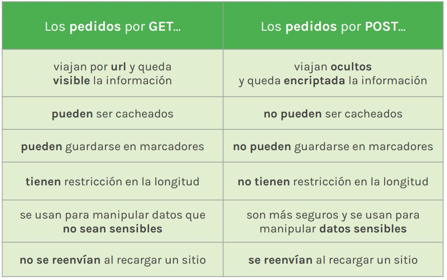

# Lección 12: MÉTODOS HTTP

* MÉTODOS HTTP
* MÉTODOS DE TRANSACCIÓN
* MÉTODO GET
* MÉTODO POST
* DIFERENCIAS ENTRE GET Y POST
* MÉTODO PUT
* MÉTODO DELETE

## MÉTODOS HTTP

El protocolo HTTP define una serie de reglas que es necesario seguir para que la información pueda ser procesada.

## MÉTODOS DE TRANSACCIÓN

El flujo de transacción que propone el protocolo HTTP viene acompañado de varios métodos que definen lo que pasará con cada pedido que le solicite un cliente a un servidor.

En express podemos implementar los métodos sobre la ejecución de express - app - o sobre el sistema de rutas del sistema - router

Como buena práctica se sugiere trabajar los métodos
directamente sobre la ejecución de express entendiendo que
es la arquitectura más recomendada.

## MÉTODO GET

Con este método podemos solicitarle datos al servidor.
Al acceder a una página a través de una url estoy haciendo una petición con get.

## MÉTODO POST

Con este método podemos enviarle datos al servidor.
Al registrarme en un sitio nuevo con mis datos estoy haciendo una petición con post

## DIFERENCIAS ENTRE GET Y POST

## MÉTODO PUT
Con este método podemos reemplazar información existente.
Al cambiar información personal en instagram estoy haciendo una petición con put.

## MÉTODO DELETE

Con este método podemos borrar un registro existente en el servidor.
Al borrar una foto de facebook estoy haciendo una petición con delete.

No todos los navegadores
implementan PUT, PATCH y
DELETE con lo cual varios
frameworks tienen algunas
prestaciones para simularlos.

