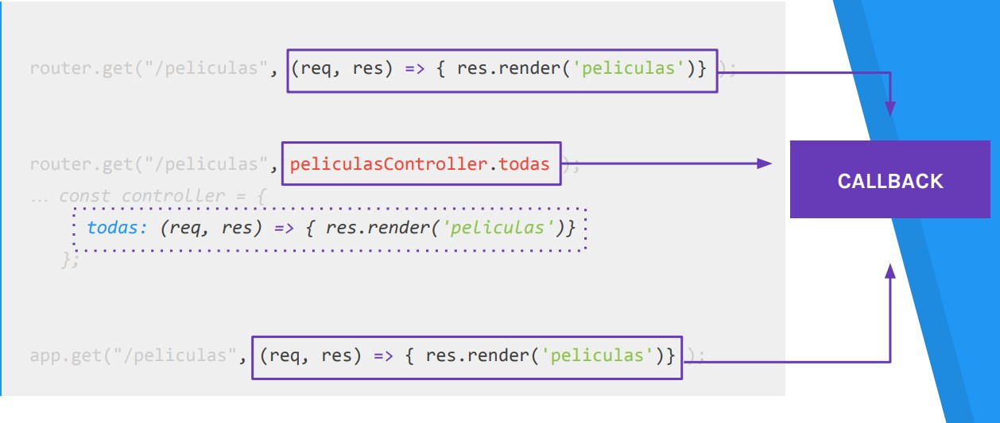

# Lección 13: PROCESAMIENTO GET

* PROCESAMIENTO GET
* MANEJAR PETICIONES GET


## PROCESAMIENTO GET

Las peticiones que se hacen por get son todas aquellas que vienen directamente desde la URL del navegador o internamente en la página desde un enlace.

## MANEJAR PETICIONES GET

Comúnmente usamos el método get para:
● Retornar vistas
● Retornar archivos
● Retornar datos

Cuando definimos una ruta podemos hacerlo directamente sobre la ejecución de express, implementar un sistema de ruteo o también incorporar controladores que se encarguen de manejar las rutas.

Sin importar el camino que elijamos para implementar en nuestra aplicación, es en el callback de la ruta que estamos definiendo en donde escribiremos la lógica para manejar la petición que esté llegando.

```javascript
// enrutador
router.get("/peliculas", (req, res) => { res.render('peliculas')} );
// enrutador con controlador
router.get("/peliculas", peliculasController.todas );
… const controller = {
todas: (req, res) => { res.render('peliculas')}
 };
// sobre la ejecución de express
app.get("/peliculas", (req, res) => { res.render('peliculas')} );
```




## QUERY STRING

Es una cadena de texto -conocida como cadena de consulta- que viaja en la url al momento de hacer una petición al servidor.

El query string comienza al final de la ruta con el signo ? . Está formado por el par clave:valor. En el caso de haber más de un par son separados por el caracter & :

https://www.youtube.com/results?search_query=arbusta


Para acceder al query string dentro del callback que maneja la petición lo haremos a través de la propiedad query del objeto request.
Esta propiedad es un objeto literal, en donde sus claves y valores serán las mismas que viajen en la url:

```javascript
console.log(req.query.search_query)
 //arbusta
 ```
 


