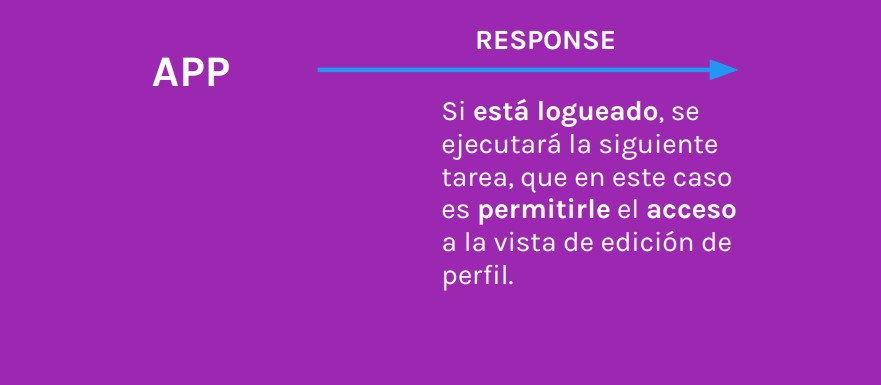
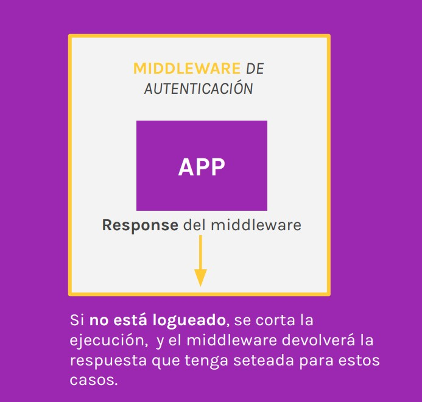
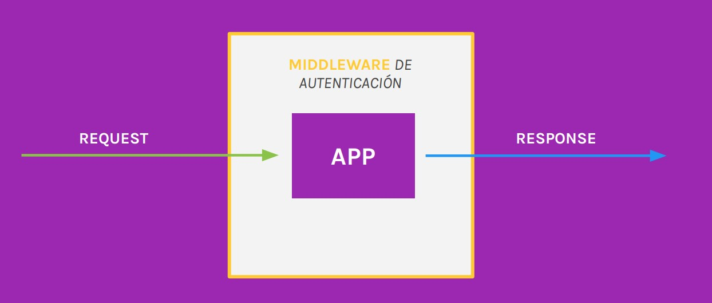

# Lección 23: INTRODUCCIÓN A MIDDLEWARES 

* INTRODUCCIÓN A MIDDLEWARES 

## INTRODUCCIÓN A MIDDLEWARES 

Express trata al request y response como objetos.
Recibe una petición, la procesa y devuelve un objeto como respuesta.

Toda petición requiere de una serie de pasos para ser procesada. Express divide esas responsabilidades en funciones denominadas middlewares.

Los middlewares son funciones que se ejecutan en medio de la ejecución del pedido del cliente y la respuesta del mismo

Las rutas que requieran middlewares -además del request y el response-deberán recibir un tercer parámetro: la función next

next permite la ejecución en cadena de todas las funciones necesarias que deberán ejecutarse antes de enviarle la respuesta al cliente.

Con los middlewares podemos aislar código que nos permita resolver un escenario en particular e implementarlo en donde sea necesario, evitando así repetir código.

Estas funciones agregan una capa de seguridad. Si la función que definimos como middleware no retorna lo esperado, la misma cortará la ejecución en cadena y devolverá la respuesta seteada para esos casos

