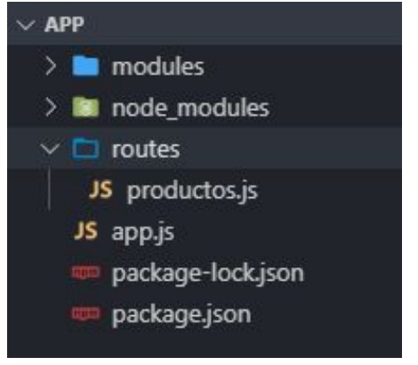

# Lección 3: Router

* Routing + Response --_ Rutas en Express:
* DEFINIENDO UNA RUTA
* Routing + Response--_ Rutas Parametrizadas
* Routing + Response--_Sistema de ruteo :
* ARQUITECTURA DE ARCHIVOS
* SISTEMA DE RUTEO

## Routing + Response --_ Rutas en Express

A través del sistema de ruteo de Express podemos definir, de manera sencilla, cómo va a responder nuestra aplicación según el método HTTP y la ruta que esté llegando al servidor.

## DEFINIENDO UNA RUTA

A través de Express, contamos con una estructura básica para
definir cada una de las rutas y sus respuestas de nuestra
aplicación:

```javascript
//1    2  3     4        5     6
 app.get('/', function (req , res) {
res.send('¡Hola mundo!');  // 7
 })
```

1-app
Variable que guarda la ejecución de Express.

2-Método
Escribimos el método HTTP que queremos
atender: get, post, put, patch ó delete.

3-Path
String que hará referencia a la ruta en sí (url que
llegará por petición).

4-Handler
Callback que se encargará de definir qué acción
tomar cuando se acceda a la ruta definida.

5-Request (primer parámetro del handler)
Es un objeto literal con múltiples métodos y
propiedades. Representa al request solicitado

6-Response (segundo parámetro del handler)
Es un objeto literal con múltiples métodos y
propiedades. Representa al response que dará el
servidor

7-Cuerpo del handler
Definimos la lógica que va a manejar la ruta
definida. Se estila dar la respuesta que verá el
cliente en su navegador.


## Routing + Response--_ Rutas Parametrizadas

Express nos permite crear rutas
dinámicas en las que definimos
qué parámetro es el que va a ir
variando. 

Usando la misma estructura básica para definir una ruta,
aclaramos en el path, cuál es el parámetro que va a ir variando
haciendo uso de los dos puntos , seguido del nombre que
represente al dato que estará llegando en la url.

```javascript
//                     1
 app.get('/productos/:id', function (req,res) {
 // código
 })
```

1-Parámetro obligatorio
Definimos el parámetro variable que sí o sí va a
llegar a través de la url.

Usando la misma estructura básica para definir una ruta,
aclaramos en el path cuál es el parámetro que va a ir variando
haciendo uso de los dos puntos , seguido del nombre que
represente al dato que estará llegando en la url.

```javascript
//                     2
 app.get('/productos/:id?', function (req,res) {
 // código
 })

 ```
2- Parámetro optativo
Definimos el parámetro variable que puede o no
llegar a través de la url, agregando un signo de
interrogacíon al final.

Haciendo uso de la propiedad params del objeto literal
request , podemos capturar esos valores parametrizados y así
empezar a definir qué hacer con cada uno de ellos.

Esta propiedad, a su vez, es un objeto literal que guarda los
parámetros que llegan por url con la estructura propiedad:valor,en donde cada propiedad tendrá el nombre del parámetro que
definimos en el path.

```javascript
app.get('/productos/:id', function (req,res) {
let idProducto = req.params.id;
})

```

## Routing + Response--_Sistema de ruteo 

Es importante plantear y
mantener un orden estructural
cuando desarrollamos.

## ARQUITECTURA DE ARCHIVOS

En la carpeta routes guardaremos, por cada recurso, un archivo js que administre los request a las rutas que tengan que ver con ese recurso. Cada archivo js será un módulo que exportaremos, para luego requerir dentro del entry point de la aplicación: app.js




## SISTEMA DE RUTEO

Para empezar a definir el sistema de ruteo de cada recurso,
hace falta situarse dentro del archivo js del recurso, requerir el módulo express y guardar la ejecución del método
que nos provee Express en una variable nueva.

```javascript
const express = require('express');
const router = express.Router();
```

Este método nos va a permitir modularizar por completo todo
el sistema de ruteo de una manera sencilla.

Definimos las rutas que consideremos necesarias para manejar
distintos tipos de request.

```javascript
// Ruta raiz de los productos / Inicio
router.get('/', (req, res) => {
 // código
});
// Ruta que muestra el detalle de un producto
router.get('/detalle/:id', (req, res) => {
 // código
});
```

En la última línea del archivo exportamos todo el contenido de router para hacerlo visible.

```javascript
module.exports = router;
```
Para implementarlo dentro de app.js , creamos una constante
y requerimos el módulo.

```javascript
const rutasProductos = require('./routes/productos');
```

Por último, hacemos uso del método use() que recibe dos
parámetros. El primero un string que será el nombre del
recurso, en este caso productos. Al ser una ruta debe empezar
con la / .

El segundo el nombre de la constante en la que almacenamos el
módulo del recurso.

```javascript
app.use('/productos', rutasProductos);
```
De esta forma estamos definiendo que cada solicitud del
recurso productos, sea atendida por el módulo rutasProductos
y toda su lógica
