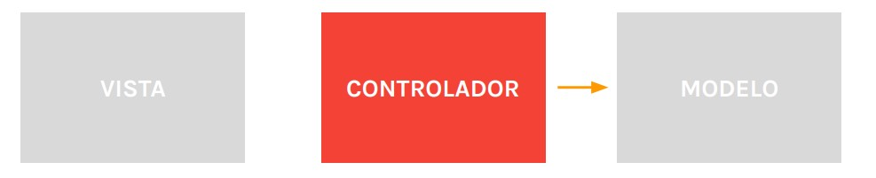

# Lección 4: MVC

* INTRODUCCIÓN A MVC
* QUE ES UN PATRÓN DE DISEÑO
* LAS VISTAS
* LOS MODELOS
* LOS CONTROLADORES
* EJEMPLO FLUJO MVC

## INTRODUCCIÓN A MVC
Es un patrón de diseño.
Sus siglas corresponden a
Modelo Vista Controlador.

## QUE ES UN PATRÓN DE DISEÑO
Dentro del mundo de la programación existen lo que se conocen
como Patrones de Diseño. Los mismos proponen un esquema
de trabajo, una serie de reglas que permiten simplificar el
código y encarar mejor la solución de diferentes situaciones a lo largo del desarrollo.
Uno de los patrones más populares es MVC. Su objetivo es crear aplicaciones modulares, dividiendo la columna vebral del proyecto en tres componentes principales, en donde cada uno de ellos cumple con un rol determinado.Estos componentes son: los modelos, las vistas y los controladores

## LAS VISTAS

Conforman la interfaz gráfica de la aplicación y contienen todos los elementos que son visibles al usuario. A través de ellas el usuario interactúa enviando y solicitando información al servidor.
Su responsabilidad es definir la apariencia de los datos y mostrarlos en pantalla.
Las vistas no se comunican de forma directa con los modelos.

## LOS MODELOS

Conforman y contienen la lógica de la aplicación.
Sus responsabilidades son conectarse con la base de datos, realizar consultas y administrar lo que se conoce como la lógica de negocio.
Los modelos no se comunican de forma directa con las vistas

## LOS CONTROLADORES

Conforman la capa intermedia entre las vistas y los modelos.
Su responsabilidad es procesar los datos que recibe de los modelos y elegir la vista correspondiente en función de aquellos datos.
Tienen relación directa con las vistas y con los modelos y es un componente fundamental dentro del flujo del patrón.

## EJEMPLO FLUJO MVC

Un usuario recorre, a través de la interfaz gráfica, un listado de productos y quiere solicitar más información acerca del producto 20.
La vista entonces se conecta con el controlador para solicitarle esos datos.

El controlador recibe la petición y le solicita al modelo el detalle del producto 20.

El modelo busca la información solicitada y se la envía al 
controlador.

El controlador recibe la información y le envía los datos a la vista

Es importante destacar que los patrones de diseño proponen una forma de trabajo y no hay nadie por detrás que regule que se cumplan tales formas.
Se utilizan como una buena práctica que facilita el trabajo en equipo, permitiendo unificar criterios y enfoques.

la vista le muestra al usuario los datos que recibió.

