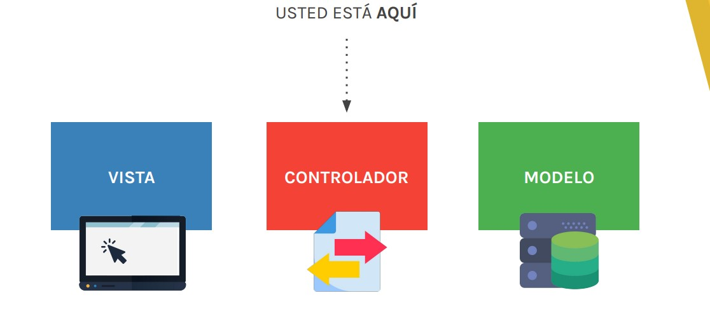
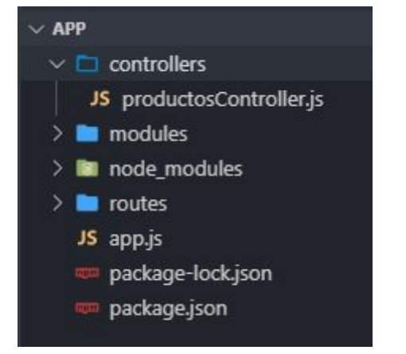
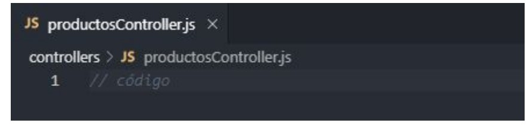

# Lección 5: LOS CONTROLADORES


* LOS CONTROLADORES
* ARQUITECTURA DE ARCHIVOS
* CREANDO UN CONTROLADOR
* IMPLEMENTAR UN CONTROLADOR


## LOS CONTROLADORES



Son pequeñas porciones de código.
Su responsabilidad es atender a los distintos request del cliente y generar comunicación entre las vistas y los modelos.

## ARQUITECTURA DE ARCHIVOS

En la carpeta raíz del proyecto, crearemos la carpeta controllers. Adentro almacenaremos un controlador por cada recurso que tenga la aplicación.
Cada controlador será un módulo que exportaremos, para luego requerirlo en donde lo necesitemos.



## CREANDO UN CONTROLADOR

Crearemos un archivo para manejar nuestro recurso. 
Para nombrar los archivos se estila empezar con el nombre del
recurso seguido de la palabra Controller usando el estilo
camelCase.



Lo primero que hay que hacer es definir una variable en el
archivo del controlador del recurso y asignarle un objeto literal.

```javascript
const controlador = {};
```
Dentro del objeto, iremos definiendo los métodos que se
encargarán de manejar, cada uno, un request en particular.

```javascript   
const controlador = {
index: //mostrar listado de productos,
show: //mostrar detalle de un producto,
create: //enviar datos para agregar un producto,
};

```

Hasta el momento, la lógica de cómo manejar cada request que
llegaba, la veníamos escribiendo en el archivo de rutas de cada recurso, en donde definíamos una url y un callback que se encargaba de manejar esa petición.

```javascript   
// código del archivo productos.js en la carpeta routes
router.get('/', (req, res) => {
res.send('Index de productos');
});
```

Al trabajar con el patrón MVC, podemos apoyarnos en sus reglas y dividir las responsabilidades de nuestros archivos. Siguiendo con esa línea, serán los métodos de cada controlador los que recibirán esos datos y enviarán la información correspondiente.
De modo que, quitaremos el callback que habíamos definido en las rutas y lo escribiremos en el método index del controlador de productos.

```javascript  
const controlador = {
index: (req, res) => {
 res.send('Index de productos');
},
};
```

Como buena práctica se suelen
usar nombres descriptivos y
lógicos para nombrar a los
métodos de un controlador.

## IMPLEMENTAR UN CONTROLADOR

Primero hay que hacer visible todo el código que definimos en el controlador. Para eso, exportaremos la variable en la última línea del archivo.

```javascript  
module.exports = controlador;
```

Para empezar a usar los métodos que definimos, debemos requerir el módulo dentro del archivo de ruteo del recurso, en este caso productos.js, dentro de la carpeta routes .

```javascript  
const productosController = require('../controllers/productosController');
```

Para ir una carpeta hacia atrás
cuando indicamos dónde está
alojado un archivo, lo hacemos
escribiendo lo siguiente al
principio de la ruta:
. . /


Con nuestro módulo ya visible en el archivo, es momento de terminar de configurar aquella ruta a la que le quitamos el callback.
La misma va a seguir recibiendo ese callback pero ahora no va a ser su responsabilidad definirlo. Para eso llamaremos al método
index del controlador de productos y le pasaremos ese método como segundo parámetro. Al ser un callback no le escribimos los paréntesis.

```javascript  
router.get('/', productosController.index);
```


