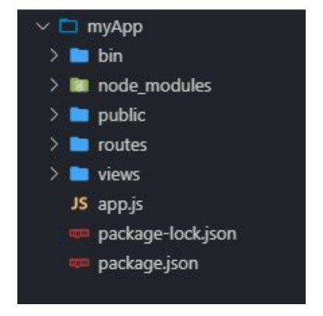
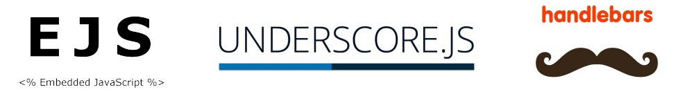
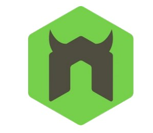

# Lección 6: express-generator


* express-generator
* QUÉ TRAE EXPRESS-GENERATOR
* ESTRUCTURA DE ARCHIVOS
* INSTALANDO EXPRESS-GENERATOR
* MOTOR DE VISTAS
* QUÉ ES NODEMON
* LEVANTAR EL SERVIDOR


## express-generator

Express cuenta con un generador de proyectos llamado express-generator.

## QUÉ TRAE EXPRESS-GENERATOR

Esta herramienta presenta una gran ventaja al momento de empezar un proyecto nuevo y es que, al instalarlo, trae consigo un esqueleto de carpetas, archivos y dependencias que nos puede servir para inicializar cualquier aplicación.



## ESTRUCTURA DE ARCHIVOS

En la carpeta raíz encontramos el entry point app.js , y el archivo package.json .

Dentro de la carpeta bin encontramos el archivo www sin extensión. El mismo trae definida una lógica interna y se encargará de hacer que la aplicación corra.

Dentro de la carpeta public podremos guardar todos los recursos estáticos de nuestra aplicación.

Dentro de la carpeta routes estaremos administrando el route system de la aplicación. Encontramos los archivos index.js y users.js .

Dentro de la carpeta views encontramos dos vistas iniciales que trae el generador:index.ejs  y error.ejs .

Este generador no trae consigo la
carpeta controllers y sus
archivos, por lo tanto tendremos
que crearla nosotros si queremos
respetar la arquitectura con la
que venimos trabajando.

## INSTALANDO EXPRESS-GENERATOR

Para poder trabajar con el generador de proyectos, lo primero que hay que hacer es instalarlo globalmente para poder usarlo en el momento que queramos.

```javascript
npm install express-generator -g
```

Lo próximo será crear un proyecto Node usando Express con un comando que creará la carpeta del proyecto con el nombre que definamos nosotros. Adicionalmente, podemos configurar el motor de vistas que queremos usar. Si no lo aclaramos, por defecto se instalará el motor de vistas pug.

```javascript
express myApp --ejs
```

Por último, dentro de la carpeta del proyecto, tenemos que correr el comando para instalar todas las dependencias que vinieron configuradas en el package.json para que el proyecto funcione.

```javascript
npm install
```

## MOTOR DE VISTAS

Los motores de vistas, también conocidos como motores de plantillas o template engines, nos permiten crear una estructura dinámica para las vistas de nuestro proyecto. Es decir, definir bloques de contenido que se pueden rellenar con datos variables.
Entre los más nombrados se encuentran EJS, Underscore, Handlebars, entre otros.



Echemos un pequeño vistazo a
algunos de los archivos de la
estructura que se generó.

index.js

app.js
En el primer bloque de este archivo encontramos los requerimientos de los módulos necesarios para empezar a desarrollar nuestra app. Entre ellos detectamos express , (framework), path(trabajar con rutas de archivos), http-errors (manejar errores http)


```javascript
var createError = require('http-errors');
var express = require('express');
var path = require('path');
var cookieParser = require('cookie-parser');
var logger = require('morgan');
var indexRouter = require('./routes/index');
var usersRouter = require('./routes/users');
var app = express();
```

## QUÉ ES NODEMON

Esta herramienta nos permite monitorizar constantemente el servidor de Node.js.
Cada vez que queremos hacer modificaciones en el código de nuestro servidor, Nodemon se encargará de hacer los «stops» y «reloads» de nuestro servidor en Node.Js, con lo que no tendremos que estar haciéndolo manualmente




## LEVANTAR EL SERVIDOR

Dentro de la carpeta del proyecto debemos correr el siguiente comando, en el cual indicaremos el archivo que queremos ejecutar.

```javascript
nodemon bin/www
```

Por último ingresar a http://localhost:3000 para comprobar que el servidor se levantó correctamente.


