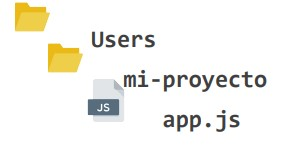

# Lección 7: Template engine


* Template engine
* INSTALACIÓN E IMPLEMENTACIÓN
* USANDO UN TEMPLATE ENGINE
* LAS VISTAS
* .set()
* __dirname

## Template engine

Un template engine es un motor de plantillas que nos permite generar un archivo que contenga estructuras dinámicas.

Dentro de esa estructura podremos definir bloques de contenido que se luego se irán rellenando con datos variables.

Dentro del ecosistema Express y el flujo MVC, el motor de plantillas es el encargado de manejar las vistas.

Algunos motores de plantillas son:
★ Handlebars
★ Mustache
★ EJS (trabajaremos con éste)
★ PUG

Debemos aclarar la extensión que corresponda –según el template que elijamos– para que nuestro archivo html se pueda transformar en un archivo dinámico 

## INSTALACIÓN E IMPLEMENTACIÓN

Para instalar un template engine en nuestro proyecto lo haremos a través de la terminal usando el gestor de dependencias NPM.

## USANDO UN TEMPLATE ENGINE

1. Definir qué motor de plantilla queremos usar en nuestra aplicación, en este caso ejs y luego instalarlo con npm.

```javascript
npm i ejs --save
```

2. Aclararle a Express cual es ese motor que vamos a estar utilizando a lo largo del proyecto utilizando el método set() con la propiedad 'view engine' y el valor del motor, en este caso ejs

```javascript
app.set('view engine', 'ejs');
```

## LAS VISTAS

Al implementar un motor de plantillas, todas las vistas que creemos en nuestro proyecto deberán almacenarse en una carpeta específica.

Por defecto, Express va a ir a buscar esas vistas a una carpeta llamada views, que tendremos que crear en nuestro directorio.

Allí almacenaremos todos los archivos de vistas con la extensión que corresponda según el motor de plantillas que hayamos instalado.

En caso de querer almacenarlas en otra carpeta, deberemos aclararlo usando el método set() 

## .set()

Es un método que nos permite definir configuraciones de express. Se ejecuta sobre la variable que tenga asociada la ejecución de express, en la mayoría de los casos llamada app .
Recibe dos strings como parámetros.
Para configurar el motor de plantillas le pasamos el string 'view engine' y el nombre del motor de plantillas que instalamos.

```javascript
app.set('view engine', 'ejs');
```

Para configurar la carpeta que almacena las vistas le pasamos el string 'view' y la ruta absoluta hacia esa carpeta haciendo uso de __dirname .

```javascript
app.set('view', __dirname + '/carpeta-vistas');
```

## __dirname

Es una variable nativa de Node. Contiene la ruta exacta del archivo en el que nos encontramos cuando la llamamos.



Partiendo de la estructura de carpetas del ejemplo, si ejecutamos un console.log de __dirname desde app js. obtendremos el siguiente string:

/Users/mi-proyecto

Para automatizar esta práctica y configurar todo en una sola línea podemos usar express-generator y ejecutar el comando 
express --view=ejs carpetaProyecto 

aclarando el motor de plantillas que instalaremos junto con el nombre de la carpeta del proyecto. 

