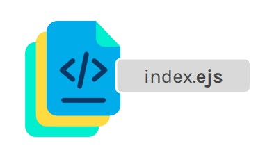

# Lección 9: Tags de EJS

* Tags de EJS
* ESTRUCTURA BÁSICA
* <% … %>
* <%= … %>


## Tags de EJS
EJS trae consigo un conjunto de etiquetas que nos permiten integrar funcionalidad de javaScript dentro de nuestras estructuras html.

## ESTRUCTURA BÁSICA

Para poder implementar las etiquetas que nos brinda el template engine, es necesario que nuestros archivos tengan la extensión .ejs .

Estos archivos seguirán soportando todas las etiquetas html, por lo tanto podremos desarrollar nuestras estructuras normalmente, sólo que ahora con la capacidad de añadirles dinamismo.



## <% … %>

Esta etiqueta nos permite incorporar código de JavaScript, como condicionales, estructuras de control de flujo, declaración de variables, etc.
¿Cómo la implementamos?
Por cada línea de javascript que escribamos, debemos encerrar ese código entre la etiqueta <% de apertura y la etiqueta %> de cierre. En el medio podemos escribir cualquier contenido html.

```javascript
<% if(4 < 5) { %>
 <h2>El 4 es menor que el 5</h2>
<% } %>
```

```javascript
for(var i=0; i<5; i++){
}
```

Como primer paso podemos
escribir la sentencia de JavaScript
que queremos embeber en nuestra
estructura general.

```javascript
<% for(var i=0; i<5; i++) { %>
<% } %>
```

Luego, encerrar cada línea entre las etiquetas de cierre y apertura de ejs que nos permiten embeber código de javascript: <% y %>

```javascript
<% for(var i=0; i<5; i++) { %>
<p> Probando la etiqueta <% </p>
<% } %>
```

Finalmente, escribiremos el contenido que queremos mostrar por cada iteración del ciclo for declarado.
En esta instancia, podemos incorporar las etiquetas de html que queramos

```javascript
Probando la etiqueta <%
Probando la etiqueta <%
Probando la etiqueta <%
Probando la etiqueta <%
Probando la etiqueta <%
```

## <%= … %>

Esta etiqueta nos permite imprimir un valor dinámico y de esta manera incorporarlo en la estructura html general.
¿Cómo la implementamos?
Al valor dinámico que busquemos renderizar, los tendremos que encerrar entre la etiqueta <%= de apertura y la etiqueta %> de cierre

```javascript
<% if(nombre) { %>
 <h2>¡Hola <%= nombre %>! </h2>
<% } %>
```

```javascript
<% for(var i=0; i<5; i++) { %>
<p> En esta vuelta la i vale <%= i %> </p>
<% } %>
```

En este ejemplo, buscamos
imprimir el valor de la variable i en
cada iteración.

A esas etiquetas de ejs las
podemos rodear de las etiquetas de
html que queramos.
De esta forma, incorporamos el
contenido dinámico dentro de la
estructura html general.

En esta vuelta la i vale 0
En esta vuelta la i vale 1
En esta vuelta la i vale 2
En esta vuelta la i vale 3
En esta vuelta la i vale 4

<%
La usamos para embeber código de
JavaScript como condicionales,
estructuras de control de flujo, etc.

<%=
La usamos para embeber código e
imprimir el resultado de una expresión o
un valor.


